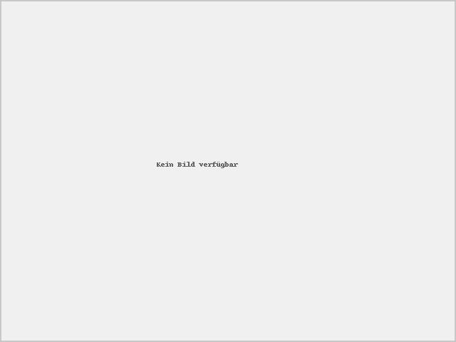

360° Drehteller Fotografie-System

## Projektbeschreibung
Dieses Projekt ist ein komplettes System zur Erstellung interaktiver 360°-Produktansichten mit einem Raspberry Pi, Arduino und einer Kamera. Der Arduino steuert einen Drehteller über ein Relais, während die Kamera automatisch Fotos aufnimmt. Die Web-Oberfläche ermöglicht die Steuerung, Konfiguration und Anzeige der 360°-Ansichten.



## Voraussetzungen

### Hardware
- Raspberry Pi 4 (mit Raspbian)
- Arduino Uno
- Relais-Modul (für 220V/30W Drehmotor)
- Webcam oder DSLR-Kamera mit USB-Anschluss
- Schneckengetriebe-Drehteller (0,8° CW Drehgeschwindigkeit)

### Software
- Python 3.8+
- pip
- Arduino IDE (für die Programmierung des Arduino)
- Git (optional, für Versionskontrolle)

## Installation

### 1. Repository klonen
```bash
git clone https://github.com/[USERNAME]/360-drehteller.git
cd 360-drehteller
2. Abhängigkeiten installieren
Führe das Installationsskript mit Administratorrechten aus:
bashCopysudo ./install_pip_modules.sh
Dieses Skript:

Aktualisiert pip
Erstellt eine virtuelle Python-Umgebung
Installiert alle benötigten Python-Pakete
Erstellt die Verzeichnisstruktur
Generiert ein Platzhalter-Bild

3. Arduino-Code übertragen
Verbinde deinen Arduino Uno mit dem Raspberry Pi und übertrage den Steuerungscode:
bashCopy./upload_arduino_sketch.sh
Schnellstart

Aktiviere die virtuelle Umgebung:

bashCopysource myenv/bin/activate

Starte die Web-Anwendung:

bashCopypython web.py

Öffne einen Browser und navigiere zu:

Copyhttp://localhost:5000
Oder von einem anderen Gerät im Netzwerk:
Copyhttp://[Raspberry-Pi-IP]:5000
Funktionen
Hauptfunktionen

Responsive Webanwendung: Funktioniert auf PC, Tablet und Smartphone
Kamerasimulator: Ermöglicht Tests ohne angeschlossene Hardware
Projektverwaltung: Organisiert verschiedene 360°-Aufnahmen
Interaktiver 360°-Viewer: Ähnlich professionellen Produktansichten im E-Commerce
Arduino-Steuerung: Präzise Steuerung des Drehtellers mit einstellbaren Winkeln

Einstellungsmöglichkeiten

Kameraauswahl und -konfiguration
Arduino-Port und Baudrate
Drehwinkel und Intervall
Bildauflösung

Verzeichnisstruktur
Copy360-drehteller/
├── web.py                      # Hauptanwendung (Flask)
├── project_manager.py          # Projektverwaltung
├── config_manager.py           # Konfigurationsmanagement
├── git_uploader.py             # Git-Upload-Werkzeug
├── arduino_drehteller_steuerung.ino  # Arduino-Sketch
├── upload_arduino_sketch.sh    # Arduino-Upload-Skript
├── install_pip_modules.sh      # Installationsskript
├── templates/                  # HTML-Templates
│   ├── index.html              # Hauptseite
│   ├── settings.html           # Einstellungen
│   ├── projects.html           # Projektverwaltung
│   ├── project_edit.html       # Projektbearbeitung
│   └── viewer.html             # 360°-Viewer
├── static/                     # Statische Dateien
│   ├── css/                    # Stylesheet-Dateien
│   ├── js/                     # JavaScript-Dateien
│   ├── photos/                 # Aufgenommene Fotos
│   └── sample_images/          # Beispielbilder für Simulator
└── projects/                   # Projektdaten
Konfiguration
Kameraeinstellungen

Unterstützt Webcams und DSLR-Kameras (via gphoto2)
Konfigurierbare Auflösung
Automatische Kameraerkennung

Arduino-Verbindung

Standard-Port: /dev/ttyACM0
Baudrate: 9600
Einfache Steuerung über serielle Befehle (0/1)

Fehlerbehandlung
Häufige Probleme

Arduino nicht erkannt

Überprüfe den Port unter Einstellungen
Stelle sicher, dass die richtige Firmware hochgeladen ist


Kamera funktioniert nicht

Überprüfe mit v4l2-ctl --list-devices
Stelle sicher, dass die Kamera erkannt wird


Relais schaltet nicht

Überprüfe die Verkabelung
Teste den Arduino mit dem Test-Skript


Entwicklung
Beiträge
Beiträge zum Projekt sind willkommen! Bitte folge diesen Schritten:

Fork des Repositories
Feature-Branch erstellen
Änderungen committen
Pull Request einreichen


Kontakt
Bei Fragen oder Anregungen stehe ich gerne zur Verfügung.

E-Mail: info €at) alexanderbehrensPungDcom
GitHub: https://github.com/alexanderbehrens1978/drehteller
